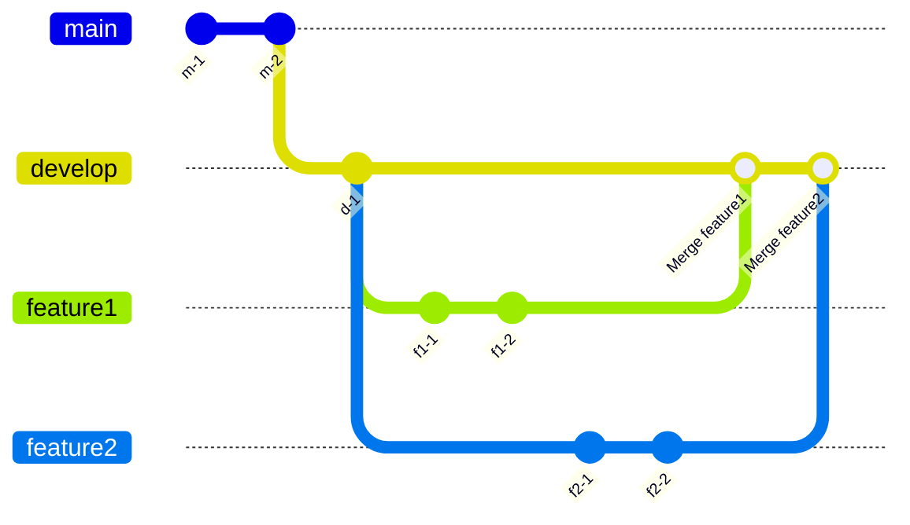
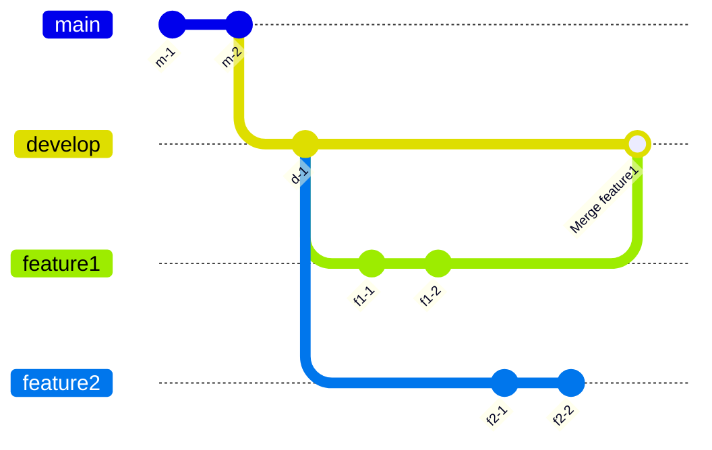
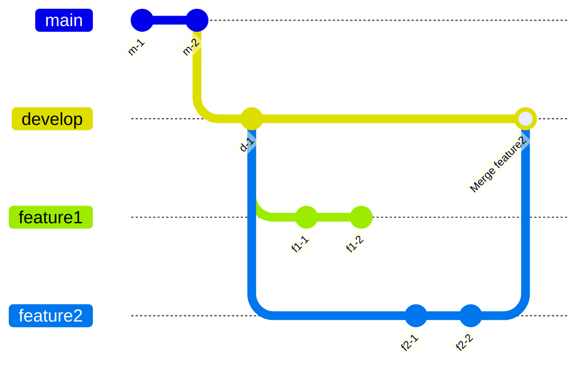
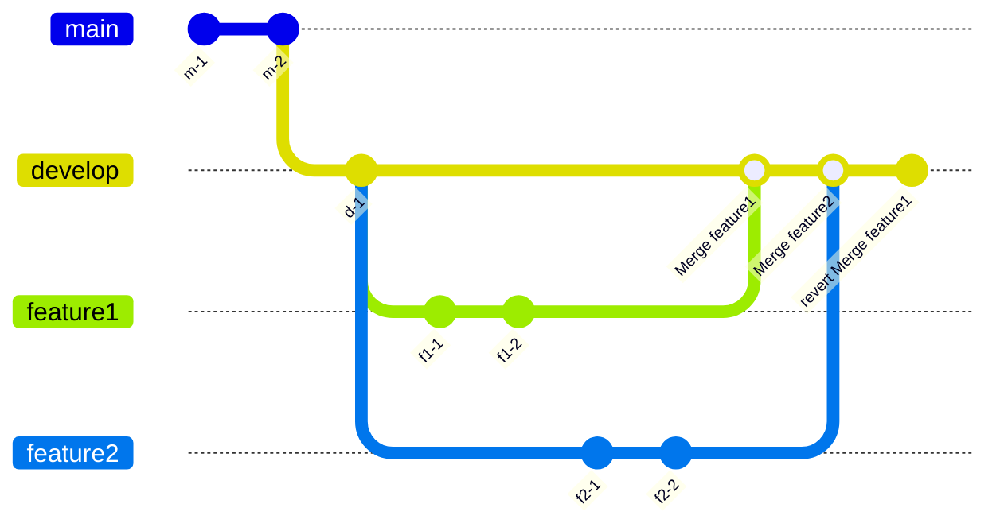

Gitでこねこねと歴史改変するのは楽しいですね。

その中で、過去のマージコミットを消す方法がわかず色々頑張っていたのですが、 ようやくその方法がわかったのでまとめていこうと思います。
## ストーリー
GitFlowのようなブランチ戦略を取っています。 すなわち、developブランチから各開発者がfeatureブランチを生やして、 プルリクを経由してdevelopブランチにマージするような開発手法を取っています。

developブランチへのマージコミットはリリースの候補となるコミットです。 リリースのタイミングには、 リリース対象となるdevelopブランチのコミットをmainブランチにマージすることでリリースを行なっています。

当然一度のリリースでは複数のfeatureブランチによる変更をデプロイすることがあります。 その場合下記のような feature1をマージした後にfeature2をマージすることになります。

この後にmainブランチにdevelopブランチをマージすることで、 feature1, feature2を取り込んだmainブランチが出来上がります。
### feature2を取り消す場合
mainブランチにマージする前（上の画像の状態）にfeature2を取り消したいような場合があります。 例えばdevelopブランチの状態で検証環境テストを行ったがfeature2起因のバグが見つかった場合などです。

この時はdevelopブランチを一つ戻して`Merge1`を最新とします。

この状態でdevelopブランチを（テストをパスすることを確認した上で） mainブランチにマージすればfeature2の内容はmainブランチに取り込まれません。

ここまでは簡単ですね。
### feature1を取り消す場合
ではfeature2を残したままfeature1だけを取り消したい場合はどうすれば良いでしょうか？ つまりこんな形にしたい場合です。

やり方は複数あります。
#### feature1のマージのrevertコミットを入れる
feature1をdevelopにマージしたという歴史は消さず、 feature1のmergeコミットに対してのrevertコミットを入れます。

developブランチでは歴史改変を許さない運用の場合はこの方法がよさそうです。 developブランチはチーム内での共有ブランチなので、 関係者が多いなど認識を合わせることが大変な場合はこの方法が一番安全だと思います。

ただし、後から見た時に決してわかりやすくはないです。
#### developをresetした後にfeature2のマージをやり直す
feature1もfeature2もマージしていない地点までdevelopブランチを戻し、 もう一度feature2をマージする方法です。

ブランチの見やすさ・わかりやすさを重視する場合はこれがよさそうです。 チーム内においてリポジトリ管理者的な旗振り役がはっきりしていて、 適度に歴史改変を許容してわかりやすさを保持するという方針ではこの方法が良さそうです。

ただしこの方法でもfeature2をマージしたコミットはやり直す必要があります。 feature2は基本的にfeature1と無関係であるのにもかかわらずです。
#### feature1のマージコミットを直接消す
ということで理想的な処理として、feature1を直接消す方法が欲しいところです。 そして今回、これをやる方法がわかったのでこの記事を書いているというわけです。

developブランチの歴史改変が許容される場合ならこの方法がベストのように思います。
## 過去のマージコミットを直接消す
ここからはCLIでの操作になりますので、 カラフルなグラフではなく硬派なテキストとなります。
### 最初の状況
こんな状況です。 横と縦が入れ替わっていますが、上のグラフと同じ状況になっています。
```
$ git log --oneline --graph
*   91213779 Merge branch 'feature2' into develop

|\  
| * 282b7dfa feature2 commit2
| * 02239f97 feature2 commit1
* |   c7ceaf61 Merge branch 'feature1' into develop

|\ \  
| |/  
|/|   
| * 6658cdc8 feature1 commit2
| * 4093f4e0 feature1 commit1
|/  
*   f01ac28d Merge commit '7f3c02fb' into develop
```
今`91213779`がdevelopブランチのHEADになっている状態です。
### マージコミットを削除する
インタラクティブモードでrebaseする際に`--rebase-merge`をつけます。 
```
git rebase --rebase-merge -i f01ac28d
```
`--rebase-merge`オプションをつけることでマージコミットを含めたコミットの履歴に対して編集を行うことができます。
```
label onto

# Branch feature1
reset onto
pick 4093f4e0 feature1 commit1
pick 6658cdc8 feature1 commit2
label feature1

# Branch feature2
reset onto
pick 02239f97 feature2 commit1
pick 282b7dfa feature2 commit2
label feature2

reset onto
merge -C c7ceaf61 feature1 # Merge branch 'feature1' into develop
merge -C 91213779 feature2 # Merge branch 'feature2' into develop
```
この表示は、rebaseがこれから行う処理工程が上から順に書かれています。 よってこのままエディタを終了すると、 rebaseは結果的に何も変更しないような一連の処理を行うことになります。

さて、ここから削除したいマージコミットの行を消します。 今回で言うとこの行です。
```
merge -C c7ceaf61 feature1 # Merge branch 'feature1' into develop
```
工程表から行を削除するので、 これでfeature1をマージするという工程がスキップされます。

これによって単純にfeature1をマージしなかったと言う状況が再現されます。 rebase実施後のコミットグラフはこうなります。
```
*   68379ce7 Merge branch 'feature2' into develop

|\  
| * 282b7dfa feature2 commit2
| * 02239f97 feature2 commit1
|/  
*   f01ac28d Merge commit '7f3c02fb' into develop
```
もちろんfeature1ブランチ自体はそのまま残っています。
```
# feature1の（マージ前の）最後のコミットに移る
$ git reset --hard 6658cdc8
```
でコミットを移した後コミットグラフを確認すると想定通りの表示となります。
```
$ git log --oneline --graph
* 6658cdc8 (HEAD -> develop, feature1) feature1 commit2
* 4093f4e0 feature1 commit1
*   f01ac28d Merge commit '7f3c02fb' into develop
```
### feature2のマージコミットについて
feature1のマージコミット削除前後でfeature2のマージコミットがどうなっているか確認します。

**feature1削除前**
```
commit 91213779d21e39e4340d2eb4a748b813b3df3b7a (HEAD -> develop)
Merge: c7ceaf61 282b7dfa
Author: hogehoge <hogehoge@example.com>
Date:   Thu May 15 14:47:11 2025 +0900

    Merge branch 'feature2' into develop
```
**feature1削除後**
```
commit 68379ce73a5d6d16fb8bce291a4c50d72a1a3790 (HEAD -> develop)
Merge: f01ac28d 282b7dfa
Author: hogehoge <hogehoge@example.com>
Date:   Thu May 15 14:47:11 2025 +0900

    Merge branch 'feature2' into develop
```

コミットハッシュは当然変化しますがコミット日時はそのままで、 feature1のマージコミットを消しただけと言う理想的な状態になっています。
## まとめ
過去のマージコミットを消す方法をご紹介しました。 Gitは（実質的に）同じことをやりたい時にいろいろな実現方法がありますが、 「ここをこうしたい」をなるべく直感的に行えた方が 後から見た時のコミットグラフがわかりやすくなります。

最初のストーリーに書いたような、 feature1のマージを無かったことにしたいケースは私の周囲では頻繁に発生して、 その度に頭を使ったGit操作を色々やっていました。 今後はよりスマートな方法でマージコミットを消せそうです！

以上、誰かのお役に立てば幸いです。

